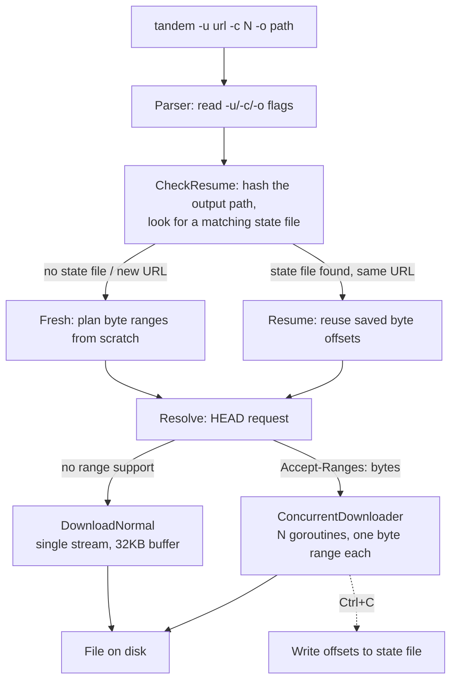
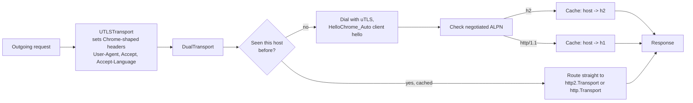

# Tandem

A CLI file downloader written in Go that grabs files concurrently over HTTP range requests when the server allows it, falls back to a plain stream when it doesnt, and can resume a download after you kill it between the ongoing download.

The reason it exists over just using `wget`/`curl` -o /`aria2`: a lot of file hosts fingerprint the TLS handshake and block anything that doesn't look like a real browser. Tandem dials its own TLS connection with [uTLS](https://github.com/refraction-networking/utls) mimicking Chrome's handshake, so it gets through where a plain Go `http.Client` gets a 403.
And another reason is that I also want to learn about this , how they work and all ...:)

## What it actually does

- **Concurrent downloads** — sends a `HEAD` first, checks for `Accept-Ranges: bytes`, and if present splits the file into N byte ranges and pulls them in parallel goroutines straight into pre-allocated file offsets (no reassembly step, no in-memory buffering of the whole file).
- **Falls back to a single stream** if the server doesn't support ranges.
- **Resumable** — every download has a state file (per-worker byte offsets) written to disk on `Ctrl+C`. Run the same command again and it picks up from where each worker stopped instead of starting over.
- **TLS fingerprint spoofing** — every connection goes through a `uTLS` client hello that mimics Chrome (`HelloChrome_Auto`), so sites doing JA3/TLS-based bot detection see what looks like a normal browser handshake, not a Go script.
- **HTTP/1.1 + HTTP/2 dual transport** — negotiates ALPN once per host and caches which protocol to use for the rest of the connections to that host, instead of re-negotiating every request.
- **Cloudflare challenge tier (WIP)** — there is a `FlareSolverr`-backed solver and a "reuse your Chromium session cookie" tier in the codebase for sites behind a Cloudflare challenge page. Not wired into the default request chain yet, more on that below.

## How a download actually flows



Every request — the `HEAD`, and every ranged `GET` from every worker — goes through the same custom transport instead of Go's default `http.Transport`. That's the part doing the fingerprint spoofing.

## The TLS layer



The handshake itself is the important bit: Go's stdlib `http.Transport` can't use `uTLS` directly, because `DialTLSContext` is expected to hand back something the stdlib already knows is a negotiated H2 connection — and `uTLS` connections don't satisfy that internally, so the automatic HTTP/2 upgrade silently never fires. `DualTransport` works around this by doing the `uTLS` handshake itself, reading which protocol ALPN actually negotiated, and routing the request to a plain `http2.Transport` or `http.Transport` accordingly — bypassing the part of the stdlib that would otherwise break.

There's also a `LocalCookieTransport` (pulls a `cf_clearance` cookie out of your local Chromium's cookie store via KWallet, on Linux) and a `SolverTransport` (falls back to a running `FlareSolverr` instance if a Cloudflare challenge page shows up) sitting in the codebase as a 3-tier fallback chain. Right now only the uTLS tier is wired into the default client — the other two are built but not chained in yet.Because there is a presistent bug in last tier Fallback , which i am currently focused to solve.

## Install

**Prebuilt binary:** every push to `main` runs a GitHub Actions build (`.github/workflows/go_build_publish.yaml`) and uploads a Linux/amd64 binary as a build artifact — grab it from the [Actions tab](https://github.com/VAibhav1031/tandem/actions) if you don't want to build locally. There's no formal Releases page yet, so it's artifact-only for now.

**From source:**

```bash
go install github.com/VAibhav1031/tandem/cmd/tandem-cli@latest
```

or clone and build:

```bash
git clone https://github.com/VAibhav1031/tandem.git
cd tandem
go build -o tandem ./cmd/tandem-cli
```

**First run** — set up the local state/log directories:

```bash
tandem --setup # important before starting
```


## Usage

```bash
tandem -u <url> -c <concurrency> -o <output path>
```

| Flag | Description | Default |
|------|-------------|---------|
| `-u`, `-url` | URL to download | required |
| `-c`, `-concurrent` | Number of parallel workers (1–9) | 4 |
| `-o`, `-output` | Output directory or full path | current directory, filename auto-detected |

If you don't pass `-o`, Tandem figures out the filename from `Content-Disposition`, then `Content-Type`, then the URL path, in that order.

**Example:**

```bash
tandem -u https://example.com/big-file.zip -c 6 -o ~/Downloads
```

If you kill it (`Ctrl+C`) partway through, running the exact same command again resumes from the last saved byte offset per worker instead of starting over. If you point a different URL at the same output path, it detects the mismatch and downloads to a new filename instead of overwriting.

## Project layout

```
tandem/
├── cmd/tandem-cli/          # entrypoint (main.go)
├── internal/
│   ├── cli/                 # flag parsing, resume-check logic, --setup
│   ├── downloader/          # HTTP transports, TLS handling, concurrent + normal download
│   ├── cookiesManager/      # Chromium cookie extraction (Linux/KWallet)
│   └── logger/              # slog setup
└── Dockerfile
```

## Roadmap

- Progress bars per worker during a concurrent download
- Wire the cookie-reuse and FlareSolverr tiers into the default transport chain
- More interactive CLI experience


